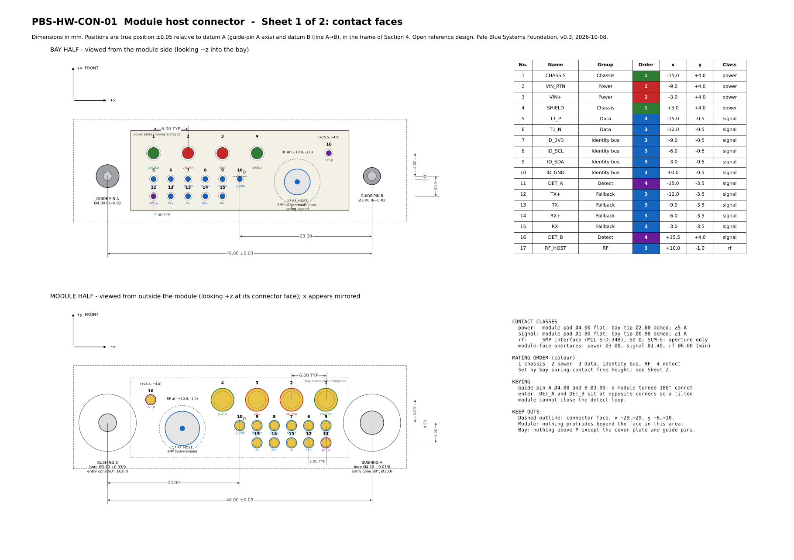
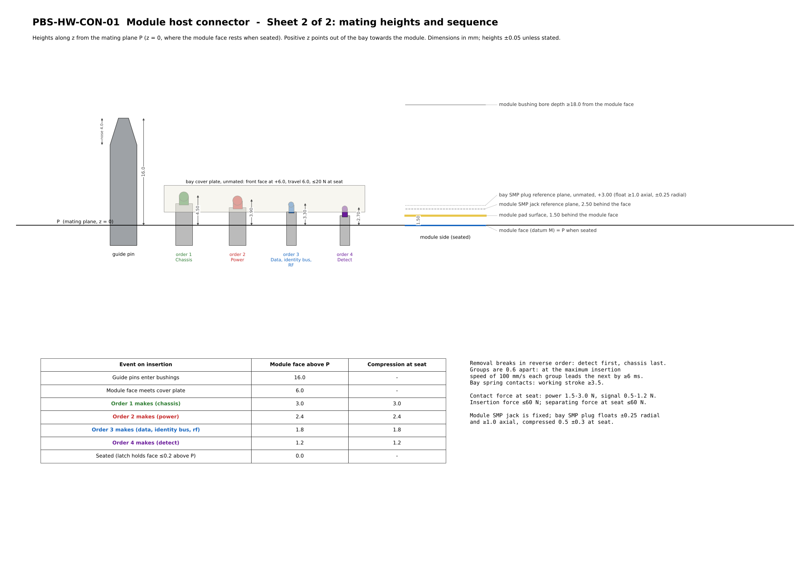

# PBS-HW-CON-01
## Module Host Connector: Open Reference Design

**Status:** Draft Reference Design (Informational)
**Version:** 0.3
**Date:** 2026-10-08
**Applies to:** The connector between a PBS-HW-SCM-01 communication module and its host bay, in both shells (SCM-S and SCM-L)
**Related:** PBS-HW-SCM-01, PBS-HW-ID-01

---

## 1. Purpose

This document defines the connector between a communication module and the bay that holds it. It specifies what must match exactly for a module from one builder to mate with a bay from another: the contact positions, the contact sizes, the mating heights that set the contact order, the guide pins and keying, the cover plate, and the electrical ratings.

It names no components and no manufacturers. The contacts are defined by their geometry and ratings, so any builder can make or buy them. Where an existing open interface standard fits, it is referenced (MIL-STD-348 for the coaxial contact).

The connector serves PBS-HW-SCM-01 REQ-010 to REQ-013. Where this document and PBS-HW-SCM-01 Section 5 overlap, they say the same thing; this document adds the geometry.

---

## 2. Requirement Levels

As in PBS-HW-SCM-01 Section 3: **[I]** interoperability requirements must be met exactly; **[P]** minimum-performance requirements are floors; informative text is not binding. Normative statements use MUST, SHALL, SHOULD and MAY as in RFC 2119 and RFC 8174 and bind only implementations that claim to follow this document.

---

## 3. Overview

The drawings are also available as PDF: [sheet 1](drawings/PBS-HW-CON-01-sheet1.pdf), [sheet 2](drawings/PBS-HW-CON-01-sheet2.pdf).

The connector is a **face-to-face, axial, blind-mate** connector. The module is pushed straight into the bay, connector face first.

| Half | What it carries |
|---|---|
| **Module half** | Flat contact pads, recessed 1.50 mm behind the module's connector face and covered when unmated; two guide bushings; an SMP coaxial jack (SCM-L) or an empty aperture (SCM-S) |
| **Bay half** | Spring-loaded contacts whose free heights set the mating order; a spring-returned cover plate that hides the contacts until the module face pushes it down; two guide pins of different diameters; a floating SMP coaxial plug where the host provides an antenna |

There are no sockets for regolith to pack into. All the moving parts and wiping surfaces are on the bay side, which can be serviced in place; the module side has no moving contacts.

The connector face is centred on the module's base, the 100 × 100 mm face common to both shells (PBS-HW-SCM-01 Section 5.1). One bay therefore takes either shell.

---

## 4. Frame and Datums

PBS-CON-REQ-001 [I]: All positions in this document are given in this frame, fixed to the bay:

| Element | Definition |
|---|---|
| Mating plane **P** | The plane on which the module's connector face rests when the module is seated |
| Origin **O** | On P, midway between the axes of guide pins A and B |
| **z** | Along the insertion axis, positive out of the bay towards the module |
| **x** | Along the line from guide pin A to guide pin B, positive towards B |
| **y** | z × x, positive towards the **front** of the bay and module: the side that carries the handle or release and the ready indicator |
| Datum **A** | The axis of guide pin A (bay) or bushing A (module) |
| Datum **B** | The line from datum A to the axis of guide pin B or bushing B |
| Datum **M** | The module's connector face |

When the module face is viewed from outside the module, x appears mirrored (sheet 1, lower view).

PBS-CON-REQ-002 [I]: On the module, O MUST lie within ±0.25 mm of the centre of the base face, and x MUST be parallel to one edge of the base face within ±0.5°.

PBS-CON-REQ-003 [I]: Unless stated otherwise, contact positions MUST be within ±0.05 mm of true position relative to datums A and B, and heights MUST be within ±0.05 mm.

---

## 5. Contacts

### 5.1 Contact map

PBS-CON-REQ-010 [I]: The connector MUST have the 17 contacts below, at the positions given. The order is the mating order of PBS-HW-SCM-01 REQ-010: 1 makes first and breaks last.

| No. | Name | Group | Order | x (mm) | y (mm) | Class | Function |
|---|---|---|---|---|---|---|---|
| 1 | CHASSIS | Chassis | 1 | −15.0 | +4.0 | Power | Chassis ground |
| 2 | VIN_RTN | Power | 2 | −9.0 | +4.0 | Power | Supply return |
| 3 | VIN+ | Power | 2 | −3.0 | +4.0 | Power | Supply positive, 18–36 V DC |
| 4 | SHIELD | Chassis | 1 | +3.0 | +4.0 | Power | Host cable shield |
| 5 | T1_P | Data | 3 | −15.0 | −0.5 | Signal | 100BASE-T1, positive |
| 6 | T1_N | Data | 3 | −12.0 | −0.5 | Signal | 100BASE-T1, negative |
| 7 | ID_3V3 | Identity bus | 3 | −9.0 | −0.5 | Signal | Tag supply, from the module |
| 8 | ID_SCL | Identity bus | 3 | −6.0 | −0.5 | Signal | Tag clock |
| 9 | ID_SDA | Identity bus | 3 | −3.0 | −0.5 | Signal | Tag data |
| 10 | ID_GND | Identity bus | 3 | 0.0 | −0.5 | Signal | Tag ground |
| 11 | DET_A | Detect | 4 | −15.0 | −3.5 | Signal | Swap detect, driven by the module |
| 12 | TX+ | Fallback | 3 | −12.0 | −3.5 | Signal | RS-422, module transmit, positive (Y) |
| 13 | TX− | Fallback | 3 | −9.0 | −3.5 | Signal | RS-422, module transmit, negative (Z) |
| 14 | RX+ | Fallback | 3 | −6.0 | −3.5 | Signal | RS-422, module receive, positive (A) |
| 15 | RX− | Fallback | 3 | −3.0 | −3.5 | Signal | RS-422, module receive, negative (B) |
| 16 | DET_B | Detect | 4 | +15.5 | +4.0 | Signal | Swap detect, sensed by the module |
| 17 | RF_HOST | RF | 3 | +10.0 | −1.0 | RF | 50 Ω coaxial to a host antenna (SCM-L) |

Rows are 4.0, −0.5 and −3.5 mm from the guide-pin line. Power-class contacts are on a 6.0 mm pitch; signal-class contacts on a 3.0 mm pitch. Pairs (5–6, 12–13, 14–15) are adjacent in one row. The detect contacts sit at opposite corners of the contact field, so a module seated at an angle does not close the detect loop.

PBS-CON-REQ-011 [I]: Directions TX and RX are named from the module. The bay MUST connect contacts 12–13 to the host's RS-422 receiver and 14–15 to the host's RS-422 transmitter.

### 5.2 Contact sizes

PBS-CON-REQ-020 [I]: Contacts MUST have these sizes.

| Class | Module half: flat pad diameter | Module half: minimum aperture in the face | Bay half: plunger tip diameter | Bay tip form |
|---|---|---|---|---|
| Power | 4.00 ±0.05 mm | 3.00 mm | 2.00 ±0.05 mm | Domed, radius ≥ 1.0 mm |
| Signal | 1.80 ±0.05 mm | 1.40 mm | 0.90 ±0.03 mm | Domed, radius ≥ 0.45 mm |
| RF | SMP jack (female) to MIL-STD-348 | 6.00 mm | SMP plug (male), smooth bore, to MIL-STD-348 | — |

A pad more than twice the tip diameter tolerates the guide-pin clearance and positional tolerance without the tip leaving the pad.

### 5.3 Mating heights and order

The order of make and break is set by the free heights of the bay's spring contacts, which differ by 0.60 mm per group.

PBS-CON-REQ-030 [I]: Module contact pads MUST lie 1.50 ±0.05 mm behind datum M (that is, at z = +1.50 when the module is seated).

PBS-CON-REQ-031 [I]: Bay spring contacts MUST have these free tip heights above P when unmated:

| Order | Group | Free tip height | Makes when the module face is at | Compression when seated |
|---|---|---|---|---|
| 1 | Chassis | +4.50 mm | +3.00 mm | 3.00 mm |
| 2 | Power | +3.90 mm | +2.40 mm | 2.40 mm |
| 3 | Data, identity bus | +3.30 mm | +1.80 mm | 1.80 mm |
| 4 | Detect | +2.70 mm | +1.20 mm | 1.20 mm |

PBS-CON-REQ-032 [I]: Bay spring contacts MUST have a working stroke of at least 3.50 mm, so that no contact bottoms when seated.

PBS-CON-REQ-033 [I]: Contact force at the seated compression MUST be 1.5–3.0 N for power-class contacts and 0.5–1.2 N for signal-class contacts.

PBS-CON-REQ-034 [I]: The module is seated when datum M is within 0.2 mm of P. The latch (PBS-HW-SCM-01 Section 8.2) MUST hold the module within that distance.

Guidance: each group leads the next by 0.60 mm, which is at least 6 ms at an insertion speed of 100 mm/s. The module's hot-swap function does not turn on until the detect loop closes (PBS-HW-SCM-01 Section 8.3), so power is never switched by the contacts themselves.

### 5.4 RF contact

PBS-CON-REQ-040 [I]: The RF contact MUST use the SMP interface of MIL-STD-348. The module half carries a fixed SMP jack (female), its reference plane 2.50 ±0.05 mm behind datum M. The bay half carries an SMP plug (male) with a smooth bore, its reference plane at +3.00 ±0.10 mm above P when unmated, mounted with at least 1.0 mm of axial travel and ±0.25 mm of radial float, and compressed by 0.5 ±0.3 mm when the module is seated.

PBS-CON-REQ-041 [I]: An SCM-S module, which has no RF contact, MUST still provide the 6.00 mm aperture at contact 17, clear to a depth of at least 4.0 mm behind datum M, so that a bay plug can enter it.

PBS-CON-REQ-042 [I]: A bay with no host antenna MAY omit the plug. Parts of the bay half other than the plug MUST NOT extend into the 8.0 mm diameter RF keep-out around contact 17.

---

## 6. Guide Pins and Keying

PBS-CON-REQ-050 [I]: The bay half MUST carry two guide pins, parallel to z:

| Pin | Position | Diameter | Length above P | Nose |
|---|---|---|---|---|
| A | x = −23.00, y = 0 | 4.00 +0/−0.02 mm | 16.0 ±0.1 mm | Bullet, 4.0 mm long, tapering to a 1.5 mm diameter rounded tip |
| B | x = +23.00, y = 0 | 3.00 +0/−0.02 mm | 16.0 ±0.1 mm | As A |

The pin spacing is 46.00 ±0.03 mm.

PBS-CON-REQ-051 [I]: The module half MUST carry two bushings at the same positions, with bores of 4.10 +0.03/−0 mm (A) and 3.10 +0.03/−0 mm (B), at least 18.0 mm deep from datum M, each with a 90° entry cone of 10.0 mm diameter at datum M.

The different pin diameters are the key: a module turned 180° presents the 3.10 mm bore to the 4.00 mm pin and cannot enter. The entry cones capture a pin from up to ±4.25 mm off its axis, which covers the ±3 mm lateral offset of PBS-HW-SCM-01 REQ-011.

PBS-CON-REQ-052 [I]: The guide pins MUST enter the bushings when the module face is 16.0 mm above P, before any contact touches (Section 5.3).

PBS-CON-REQ-053 [I]: The bay half (guide pins, spring contacts and cover plate together) MUST float at least ±0.5 mm in x and y and ±1° in tilt relative to the bay structure, so that the guide pins, not the shell rails, set the final alignment.

PBS-CON-REQ-054 [P]: Each guide pin MUST withstand a side load of 50 N at its tip without permanent deformation.

Guidance: bonding the guide pins and bushings to chassis makes them the first electrical path between the module and the host on insertion, ahead of contact 1, which discharges any charge difference through the pins rather than through a signal contact.

---

## 7. Covers and Cleaning

The covers protect against regolith dust (PBS-HW-SCM-01 REQ-012).

### 7.1 Bay cover plate

PBS-CON-REQ-060 [I]: The bay half MUST have a cover plate occupying x from −19.0 to +19.0 mm and y from −6.0 to +8.0 mm, which:

- when unmated, rests with its front face at +6.0 mm or higher, at least 1.5 mm above the highest contact tip;
- is pushed down by the module face during insertion and rests on P when the module is seated;
- has a hole for each spring contact and for the RF plug, through which they pass;
- returns with a force of no more than 20 N at the seated position.

PBS-CON-REQ-061 [P]: Each hole in the cover plate SHOULD have a wiper that cleans the contact or plug passing through it on every stroke.

### 7.2 Module face

PBS-CON-REQ-062 [I]: Within the connector face area (x from −29.0 to +29.0 mm, y from −8.0 to +10.0 mm), parts of the module MUST NOT protrude beyond datum M, and datum M MUST be flat within 0.1 mm.

PBS-CON-REQ-063 [P]: Each module aperture MUST be closed when unmated by a cover that opens to let the bay contact pass and closes again when it is withdrawn, fitted within the 1.50 mm between datum M and the pads. A slit elastomer membrane, which also wipes the contact as it passes, is one way to do this.

PBS-CON-REQ-064 [I]: Within the connector face area, parts of the bay half other than the cover plate and the guide pins MUST NOT extend above P.

---

## 8. Forces

PBS-CON-REQ-070 [I]: The force to insert the module from first contact with the cover plate to seated MUST NOT exceed 60 N, and the separating force at the seated position MUST NOT exceed 60 N.

PBS-CON-REQ-071 [I]: The latch (PBS-HW-SCM-01 Section 8.2) MUST hold the module seated against at least 180 N of separating force, three times the connector's maximum.

Guidance: 60 N is within what a pressurized-suit glove applies without a tool and within the payload of a small robot arm.

---

## 9. Electrical

PBS-CON-REQ-080 [P]: Each contact, mated, MUST meet these ratings:

| Class | Continuous current, in vacuum, at +85 °C | Contact resistance, new | Contact resistance after the cycles of REQ-090 |
|---|---|---|---|
| Power | 5.0 A | ≤ 10 mΩ | ≤ 25 mΩ |
| Signal | 1.0 A | ≤ 30 mΩ | ≤ 60 mΩ |

PBS-CON-REQ-081 [P]: Between any two contacts, and between any contact and chassis, the connector MUST withstand 500 V DC for 60 s and MUST have an insulation resistance of at least 1 GΩ at 100 V DC, mated and unmated.

PBS-CON-REQ-082 [P]: The mated RF contact pair MUST have a return loss of at least 19 dB (VSWR 1.25) and an insertion loss of no more than 0.2 dB from 2 000 to 2 700 MHz.

PBS-CON-REQ-083 [I]: The module MUST supply ID_3V3 (contact 7) to the host's identity tag at 3.3 V ±5 %, current-limited to no more than 50 mA. The bay MUST NOT drive ID_3V3.

PBS-CON-REQ-084 [I]: The pull-up resistors of the identity bus MUST be on the module side only. The bay MUST NOT fit pull-ups on ID_SCL or ID_SDA.

PBS-CON-REQ-085 [I]: The bay MUST join DET_A (11) and DET_B (16) with a resistance of no more than 1 Ω, and MUST NOT connect them to anything else. The module MUST drive the loop at no more than 5 V and 10 mA.

PBS-CON-REQ-086 [I]: In the module, CHASSIS (1) and SHIELD (4) MUST be bonded to the module structure, and VIN_RTN (2) and ID_GND (10) MUST be isolated from it. The host makes the single bond between supply return and chassis.

---

## 10. Environment and Life

PBS-CON-REQ-090 [P]: The connector MUST withstand at least 500 mating cycles in lunar regolith simulant with the contact resistances of REQ-080 maintained (PBS-HW-SCM-01 REQ-013).

PBS-CON-REQ-091 [P]: The connector MUST mate and unmate from −40 °C to +85 °C, and MUST survive −150 °C to +125 °C, mated or unmated.

PBS-CON-REQ-092 [P]: Polymers in the connector MUST have a total mass loss of no more than 1.0 % and collected volatile condensable material of no more than 0.1 % when tested to ASTM E595.

Guidance: hard gold over a nickel barrier on both the pads and the plunger tips avoids the tin whiskers, cadmium and zinc that vacuum and cold make dangerous. Making the pad and tip of different hardness reduces the risk of cold welding between clean metal surfaces in vacuum.

---

## 11. Verification

| Requirements | Verification |
|---|---|
| Frame and positions (001–003, 010, 020, 050, 051) | Coordinate measurement of the module half and the bay half against the drawings |
| Heights and order (030–034) | Height measurement; make and break order recorded by slow insertion and removal, both directions, at the extremes of float |
| RF (040–042, 082) | Measurement to MIL-STD-348 interface dimensions; return and insertion loss of the mated pair; SCM-S module inserted into a bay with a plug |
| Keying and alignment (052–054) | Insertion attempted at 180°; insertion from ±3 mm and ±2° offsets (PBS-HW-SCM-01 REQ-011); side-load test |
| Covers (060–064) | Inspection of the covers unmated; dust ingress after the cycles of REQ-090 |
| Forces (070, 071) | Force-displacement curve over the full insertion; latch pull test |
| Electrical (080–086) | Current, resistance, withstand voltage and insulation tests; identity-bus and detect-loop tests with a reference bay |
| Environment (090–092) | Mating cycles in regolith simulant by robot gripper and by pressurized glove; thermal mating and survival tests; outgassing data for each polymer |

Interoperability is shown by mating a module half from one builder with a bay half from another.

---

## 12. Reference Implementation

The KiCad projects in [`kicad/`](kicad/) carry both halves:

- **Module half:** J1 of `pbs-scm-core`, on the back of the core board, centred, with the guide bushings passing through the board. The contact pads are the board's own copper, finished in hard gold.
- **Bay half:** J1 of `pbs-scm-bay`, with plated holes for the spring contacts and the RF plug, holes for the guide pins, and a 3D model that shows the contact heights, the guide pins and the cover plate in its unmated position.

Both footprints and the drawings above are generated from one geometry file, [`kicad/tools/connector.py`](kicad/tools/connector.py). Where the drawings and this document differ, this document governs.

---

## 13. Open Issues

1. **Shell rails and bay dimensions.** The rails that bring the module within ±3 mm of the guide pins, and the bay's inside dimensions, are to be published with PBS-HW-SCM-01 version 1.0.
2. **Grapple feature** (PBS-HW-SCM-01 REQ-060), to be published with PBS-HW-SCM-01 version 1.0.
3. **Hardware licence.** As in PBS-HW-SCM-01 Section 14.

---

## 14. Summary

PBS-HW-CON-01 fixes the module connector exactly: 17 contacts at stated positions, flat pads on the module and spring contacts in the bay, a mating order set by four free heights 0.60 mm apart, two guide pins of different diameters that align and key the module, a cover plate and covered apertures against dust, and the electrical ratings each contact must carry. Any module half and any bay half built to it mate.
